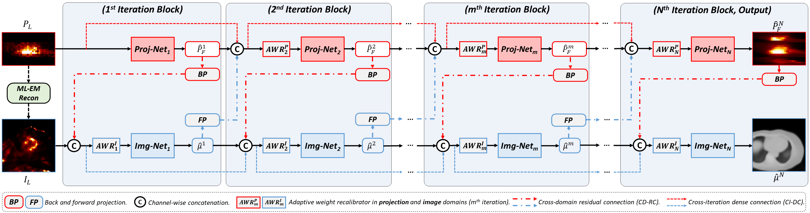
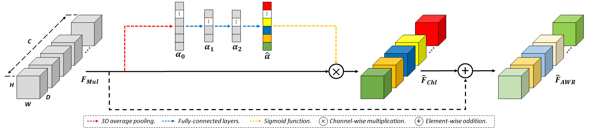

# Cross-Domain Iterative Network (CDI-Net) for Simultaneous Denoising, Limited-angle Reconstruction, and Attenuation Correction of Cardiac SPECT

**_(MICCAI 2023 Workshop, MLMI2023)_**

Xiongchao Chen, Bo Zhou, Huidong Xie, Xueqi Guo, Qiong Liu, Albert J. Sinusas, Chi Liu

[[Paper Link](https://arxiv.org/abs/2305.10326)]




This repository contains the PyTorch implementation of the CDI-Net for Simultaneous Denoising, Limited-angle Reconstruction, and Attenuation Correction of Cardiac SPECT.

### Citation
If you use this code for your research or project, please cite:

    @article{chen2023cross,
      title={Cross-domain Iterative Network for Simultaneous Denoising, Limited-angle Reconstruction, and Attenuation Correction of Low-dose Cardiac SPECT},
      author={Chen, Xiongchao and Zhou, Bo and Xie, Huidong and Guo, Xueqi and Liu, Qiong and Sinusas, Albert J and Liu, Chi},
      journal={arXiv preprint arXiv:2305.10326},
      year={2023}
     }


 ### Environment and Dependencies
 Requirements:
 * Python 3.6.10
 * Pytorch 1.2.0
 * numpy 1.19.2
 * scipy
 * scikit-image
 * h5py
 * tqdm

Our code has been tested with Python 3.6.10, Pytorch 1.2.0, CUDA: 10.0.130 on Ubuntu 18.04.6.

 ### Dataset Setup
    Data
    ├── train                # contain training files
    |   ├── data1.h5
    |       ├── Amap.mat  
    |       ├── Recon_LD_LA_EM.mat
    |       ├── Proj_FD_FA_EM.mat  
    |       ├── Proj_LD_LA_EM.mat
    |       ├── Mask_Proj.mat
    |   └── ...  
    | 
    ├── valid               # contain validation files
    |   ├── data1.h5
    |       ├── Amap.mat  
    |       ├── Recon_LD_LA_EM.mat
    |       ├── Proj_FD_FA_EM.mat  
    |       ├── Proj_LD_LA_EM.mat
    |       ├── Mask_Proj.mat
    |   └── ...  
    |
    ├── test                # contain testing files
    |   ├── data1.h5
    |       ├── Amap.mat  
    |       ├── Recon_LD_LA_EM.mat
    |       ├── Proj_FD_FA_EM.mat  
    |       ├── Proj_LD_LA_EM.mat
    |       ├── Mask_Proj.mat
    |   └── ...  
    └── ...  


where \
`Amap`: CT-derived attenuation maps with a size of 72 x 72 x 40. \
`Recon_LD_LA_EM`: reconstructed lose-dose and limited-angle images with a size of 72 x 72 x 40. \
`Proj_FD_FA_EM`: full-dose and full-angle projections with a size of 32 x 32 x 20. \
`Proj_LD_LA_EM`: lose-dose and limited-angle projections with a size of 32 x 32 x 20. \
`Mask_Proj`: binary projection mask with a size of 32 x 32 x 20. 1 refers to the central limited-angle regions. \

- Train the model 
```bash
python train.py --experiment_name 'train_1' --model_type 'model_cnn' --data_root './' --norm 'BN' --net_filter 32 --n_denselayer 6 --growth_rate 32 --lr_G1 1e-3 --lr_G2 1e-4 --step_size 1 --gamma 0.99 --n_epochs 400 --batch_size 1 --eval_epochs 5 --snapshot_epochs 5 --gpu_ids 0
```
where \
`--experiment_name` experiment name for the code, and save all the training results in this under this "experiment_name" folder. \
`--model_type`: model type used (default convolutional neural networks). \
`--data_root`: the path of the dataset. \
`--norm`: batch normalization in the CNN modules (default: 'BN'). \
`--net_filter`: num of filters in the densely connected layers (default: 32). \
`--n_denselayer`: num of the densely connected layers (default: 6). \
`--growth_rate`: growth rate of the densely connected layers (default: 32). \
`--lr_G1`: learning rate of Proj-Nets (default: 1e-3). \
`--lr_G2`: learning rate of Img-Nets (default: 1e-4). \
`--step_size`: num of epoch for learning rate decay .\
`--gamma`: learning decay rate. \
`--n_epochs`: num of epochs of training. \
`--batch_size`: training batch size. \
`--test_epochs`: number of epochs for periodic validation. \
`--save_epochs`: number of epochs for saving trained model. \
`--gpu_ids`: GPU configuration.


- Test the model 
```bash
python test.py --resume './outputs/train/checkpoints/model_xxx.pt' --experiment_name 'test_xxx' --model_type 'model_cnn' --data_root '../' --norm 'BN' --net_filter 32 --n_denselayer 6 --growth_rate 32 --batch_size 1 --gpu_ids 0
```
where \
`--resume`: the path of the model to be tested. \
`--resume_epoch`: training epoch of the model to be tested. 


### Data Availability
The original dataset in this study is available from the corresponding author (chi.liu@yale.edu) upon reasonable request and approval of Yale University. 

### Contact 
If you have any questions, please file an issue or directly contact the author:
```
Xiongchao Chen: xiongchao.chen@yale.edu, cxiongchao9587@gmail.com
```


    
